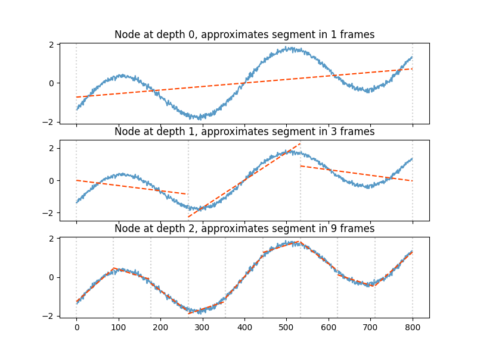
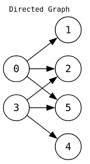
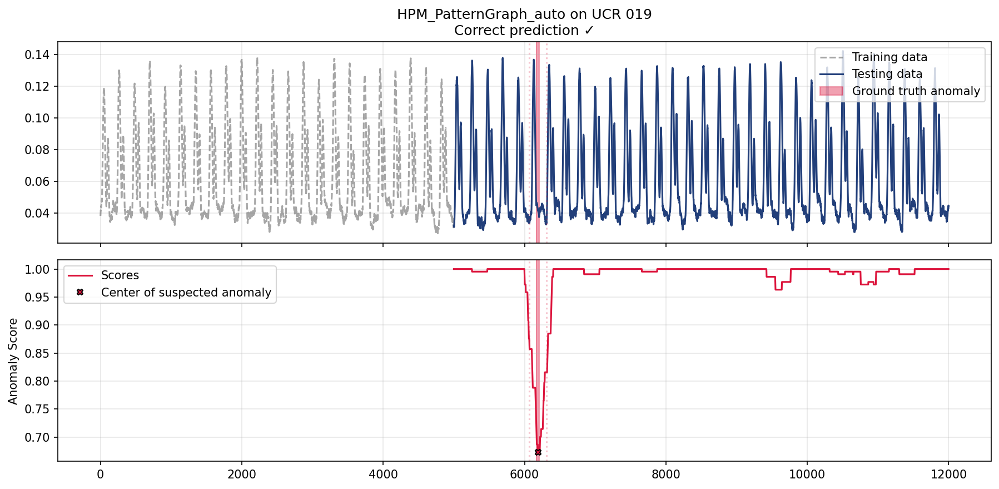
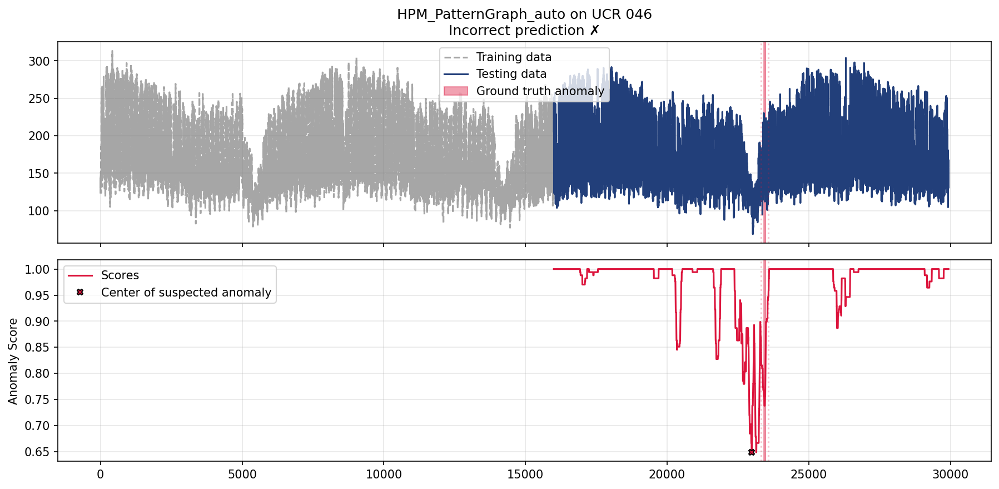

# Pattern-Based Series Framework

A Python module for **pattern-based sequence learning** using **hierarchical piecewise approximation**. This library implements the concepts presented in the following conference paper:

> [**A Hierarchical Piecewise Approximation Framework for Pattern-Based Sequence Learning** ](https://bnaic2025.unamur.be/accepted-submissions/accepted_poster/072%20-%20A%20Hierarchical%20Piecewise%20Approximation%20Framework%20for%20Pattern-Based%20Sequence%20Learning.pdf)
> *Patrick Van der Spiegel, Johan Loeckx*
> Vrije Universiteit Brussel (VUB) – Artificial Intelligence Lab – Applied Research Team
> BNAIC/BeNeLearn 2025: 37th Benelux Conference on Artificial Intelligence and the 34th Belgian Dutch Conference on Machine Learning. 2025.


---

## Table of Contents
1. [Introduction](#introduction)
2. [Overview](#conceptual-overview)
3. [Installation](#installation)
4. [Usage](#usage)
   - [Segmenters](#segmenters)
   - [Discretisers](#discretisers)
   - [Nodes](#nodes)
   - [Models](#models)
   - [Utilities](#utilities)
   - [Algorithms](#algorithms)
5. [Benchmarking](#benchmarking)
6. [Available Components](#available-components)
7. [References](#references)

---

## Introduction

The **Pattern-Based Series Framework (`pbsf`)** provides a Python module for designing, testing, and evaluating algorithms that operate on **sequential data**. It is particularly suited for sequence learning tasks such as **pattern discovery**, **anomaly detection**, and **sequence classification**.

The framework currently focused on anomaly detection, and implements the approach described in the accompanying paper. This approach represents sequences using models containing subsequence approximations that capture local and global trends at multiple scales.

---

## Conceptual Overview

1. **Segmentation**  
   - Divide sequence data into contiguous subsequences (e.g., fixed-size sliding windows).

2. **Discretisation**  
   - Approximate each subsequence by repeated application of piecewise approximation method, from coarse- to fine-grained approximation.  
   - Encapsulate each local pattern as a ``Node`` that encodes the approximation.

3. **Aggregation**  
   - Combine discretised subsequences into an aggregate ``Model`` (e.g., a `PatternTree`) that captures pattern relationships and recurrences.

---

### Key Components

| Component | Description                                                                                                                                          |
|------------|------------------------------------------------------------------------------------------------------------------------------------------------------|
| **Segmenters** | Divide series data into contiguous subsequences or segments.                                                                                                     |
| **Discretisers** | Convert segments into coarse- to fine-grained representations using piecewise models.                                                 |
| **Nodes** | Basic representational units that store results of the approximation (such as slopes and intercepts), and parameters (such as a distance threshold). |
| **Models** | Graph-based, tree-based, or automaton-based aggregations of nodes capturing relationships between recurring patterns.                                                  |
| **Algorithms** | Higher-level methods that combine segmentation, discretisation, and aggregation for sequence learning tasks such as anomaly detection.               |

---

## Installation

### Requirements

- Python 3.10 or higher
- NumPy
- Matplotlib (for visualisation in benchmarking)
- Graphviz (for visualising models – _optional_)

### Option 1 – Using `uv` (Recommended)

[`uv` is a fast Python project manager.](https://docs.astral.sh/uv/)
Install it via:

```bash
curl -LsSf https://astral.sh/uv/install.sh | sh
```

Then, set up a new environment and install `pbsf`:

```bash
uv init my_project
cd my_project
uv venv
uv pip install "git+https://github.com/pvdsp/pbsf-lib"
```

Or clone and install for development:

```bash
git clone https://github.com/pvdsp/pbsf-lib.git
cd pbsf-lib
uv venv
uv pip install -e .
```

### Option 2 – Using `pip`

```bash
pip install "git+https://github.com/pvdsp/pbsf-lib"
```

Or for development:

```bash
git clone https://github.com/pvdsp/pbsf-lib.git
cd pbsf-lib
pip install -e .
```

---

## Usage

Below are short examples showing how to use the main components of `pbsf`.

### Segmenters

Segmenters divide sequence data into overlapping or non-overlapping segments.

```python
import numpy as np
from pbsf.segmenters import SlidingWindow

# Create sample data
data = np.sin(np.linspace(0, 4 * np.pi, 100))

# Basic sliding window with fixed size
segmenter = SlidingWindow({'window_size': 20, 'step_size': 1})
segments = segmenter.segment(data)
print(f"Created {len(segments)} segments of shape {segments[0].shape}")

# Automatic window size detection using autocorrelation
segmenter = SlidingWindow({
    'window_size': 20,  # fallback size
    'autocorrelation': True
})
segments = segmenter.segment(data)
print(f"Detected window size: {segmenter.window_size}")

# Apply differentiation to capture rate of change
segmenter = SlidingWindow({
    'window_size': 20,
    'differentiation': True
})
segments = segmenter.segment(data)
print(f"First segment after differentiation: {segments[0]}")
```

### Discretisers

Discretisers convert continuous segments into hierarchical representations.

```python
import numpy as np
import matplotlib.pyplot as plt

from pbsf.discretisers import PiecewiseLinear
from pbsf.nodes import PLANode
from pbsf.utils.visualise import show

# Create a segment
segment = np.sin(np.linspace(0, 4 * np.pi, 800))
segment += np.linspace(0, 2, 800) + np.random.normal(0, 0.05, 800)

# Configure discretiser
discretiser = PiecewiseLinear({
    "max_depth": lambda data: 3,
    "frames": lambda depth: 3 ** depth,
    "node_type": PLANode,
    "node_params": {
        "distance_threshold": lambda depth: 0.25
    }
})

# Discretise the segment into a chain of nodes
nodes = discretiser.discretise(segment)
for node in nodes:
    print(node)

# Visualise the approximations at each depth
fig, axs = plt.subplots(3, 1, figsize=(8, 6), sharex=True)
for depth, node in enumerate(nodes):
    axs[depth].plot((segment - segment.mean()) / segment.std(), alpha=.75)
    plt.axes(axs[depth])
    axs[depth].set_title(f"Node at depth {node.depth}, approximates segment using {len(node.slopes)} frames")
    node.show()
```



### Nodes

Nodes encode structural information at different abstraction levels.

```python
import numpy as np
from pbsf.discretisers import PiecewiseLinear
from pbsf.nodes import StructuralProminenceNode

# StructuralProminenceNode captures structural similarity
discretiser = PiecewiseLinear({
    "max_depth": lambda data: 2,
    "frames": lambda depth: 2 ** depth,
    "node_type": StructuralProminenceNode,
    "node_params": {
        "structural_threshold": lambda depth: 0.25,  # Distance threshold
        "prominence_threshold": lambda depth: 0.25   # Prominence threshold
    }
})

segment = np.random.randn(100)
nodes = discretiser.discretise(segment)

# Each node contains slopes, intercepts, and thresholds
for node in nodes:
    print(node)
```

### Models

Models aggregate patterns from multiple segments to learn sequence structure.

```python
import numpy as np
from pbsf.models import PatternTree, PatternGraph, PatternSet
from pbsf.segmenters import SlidingWindow
from pbsf.discretisers import PiecewiseLinear
from pbsf.nodes import SlopeSignNode
from pbsf.utils.visualise import show

# Prepare data
train = np.sin(np.linspace(0, 4 * np.pi, 200))
segmenter = SlidingWindow({'window_size': 20})
discretiser = PiecewiseLinear({
    "max_depth": lambda d: 2,
    "frames": lambda depth: 2 ** depth,
    "node_type": SlopeSignNode,
    "node_params": {}
})

# Create chains (discretised segments)
segments = segmenter.segment(train)
chains = [discretiser.discretise(seg) for seg in segments]

# PatternSet: Simple collection of unique patterns
model = PatternSet()
model.learn(chains)
print(f"Learned {sum(len(level) for level in model.nodes)} unique patterns")

# PatternTree: Hierarchical pattern relationships
model = PatternTree()
model.learn(chains)
contains = model.contains(chains[0])
print(f"Pattern seen before: {contains}")

# PatternGraph: Graph-based pattern relationships
model = PatternGraph()
model.learn(chains)
contains = model.contains(chains[0])
print(f"Pattern seen before: {contains}")

show(model)
```



### Algorithms

High-level algorithms combine components for specific tasks.

```python
import numpy as np
from pbsf.algorithms import hpm
from pbsf.nodes import StructuralProminenceNode

# Generate training and test data
train = np.sin(np.linspace(0, 10, 200))
test = np.sin(np.linspace(0, 10, 200))
# Inject anomaly
test[50:60] = np.random.randn(10)

# Configure HPM algorithm
params = {
    'segmenter_params': {
        'window_size': 20,
    },
    'discretiser_params': {
        'node_type': StructuralProminenceNode,
    },
    'node_params': {
        'structural_threshold': lambda depth: 0.25,
        'prominence_threshold': lambda depth: 0.25,
    }
}

# Run anomaly detection
scores = hpm(train, test, params)
print(f"Anomaly scores shape: {scores.shape}")

# Lower scores indicate anomalies
anomaly_idx = np.argmin(scores)
print(f"Most anomalous point at index: {anomaly_idx}")
```

---

## Benchmarking

The repository includes a benchmarking script for evaluating anomaly detection performance on the [UCR time series anomaly archive](https://www.cs.ucr.edu/%7Eeamonn/time_series_data_2018/UCR_TimeSeriesAnomalyDatasets2021.zip).

### Running Benchmarks

```bash
cd ucr
uv run benchmark.py
```

The benchmark script will:
- Load UCR time series datasets from `ucr/data/`
- Evaluate configured algorithms on each dataset
- Generate visualisations in `ucr/results/`
- Save performance results to `ucr/results/results.csv`

### Configuring Algorithms

Edit `ucr/benchmark.py` to add or modify algorithm configurations:

```python
algorithms = [
    {
        "function": hpm,
        "name": "HPM_Custom",
        "segmenter": SlidingWindow,
        "segmenter_params": {
            "window_size": 200,
            "autocorrelation": True,
        },
        "model": PatternGraph,
        "discretiser": PiecewiseLinear,
        "discretiser_params": {
            "node_type": StructuralProminenceNode,
        },
        "node_params": {
            "structural_threshold": lambda depth: 0.25,
            "prominence_threshold": lambda depth: 0.25
        }
    }
]
```

### Visualising Results

Visualisations of anomaly scores and detected anomalies are saved in `ucr/results/figures/`. Example:




---

## Available Components

### Segmenters
- **`SlidingWindow`**: Overlapping or non-overlapping window segmentation with optional autocorrelation-based window sizing and differentiation

### Discretisers
- **`PiecewiseLinear` (PLA)**: Piecewise linear approximation
- **`PiecewiseAggregate` (PAA)**: Piecewise aggregate approximation
- **`SymbolicAggregate` (SAX)**: Symbolic aggregate approximation

### Nodes
- **`SlopeSignNode`**: Encodes slope signs (positive/negative) of PLA segments
- **`PLANode`**: Uses slopes and intercepts of PLA segments for representation, lower-bounding Euclidean distance
- **`PAANode`**: Stores PAA representation of segments, lower-bounding Euclidean distance
- **`SAXNode`**: Stores SAX representation of segments, lower-bounding Euclidean distance
- **`StructuralProminenceNode`**: Slopes and intercepts for structural similarity, standard deviation for prominence, defined in original HPM paper
- **`SumNode`**: Stores sum of values in segments for simple magnitude-based representation, toy example for demonstration

### Models
- **`PatternSet`**: Collection of unique patterns
- **`PatternTree`**: Tree-based hierarchical pattern relationships
- **`PatternGraph`**: Graph-based hierarchical pattern relationships
- **`NestedWordSet`**: Nested word representation of both linear order and hierarchy of patterns

### Utilities
- **`Word`**: Immutable finite sequence of symbols, used as input for finite acceptors
- **`NestedWord`**: A word paired with a matching relation, capturing both linear order and hierarchical nesting of symbols
- **`DFA`**: Deterministic Finite Automaton that recognises regular languages over words
- **`biDFA`**: Bidirectional DFA with states partitioned into left and right sets, recognising symmetric languages
- **`Digraph`**: Simple directed graph with vertex properties and adjacency-based edge storage
- **`LayeredDigraph`**: Directed acyclic graph enforcing a layered structure where vertices of layer *n* can only point to vertices in layer *n+1*

### Algorithms
- **Hierarchical Pattern Matching (`HPM`)**: Anomaly detection using hierarchical pattern matching against learned normal patterns

---

## References

If you use this framework in your research, please cite:

> Van der Spiegel, P., & Loeckx, J. (2025).  
> A Hierarchical Piecewise Approximation Framework for Pattern-Based Sequence Learning.  
> BNAIC/BeNeLearn 2025: 37th Benelux Conference on Artificial Intelligence and the 34th Belgian Dutch Conference on Machine Learning. 2025.
